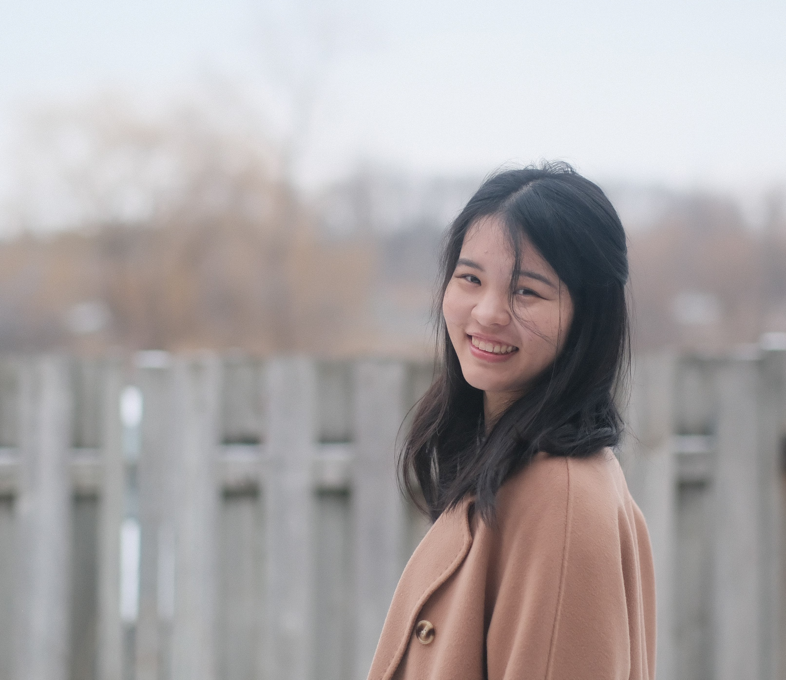
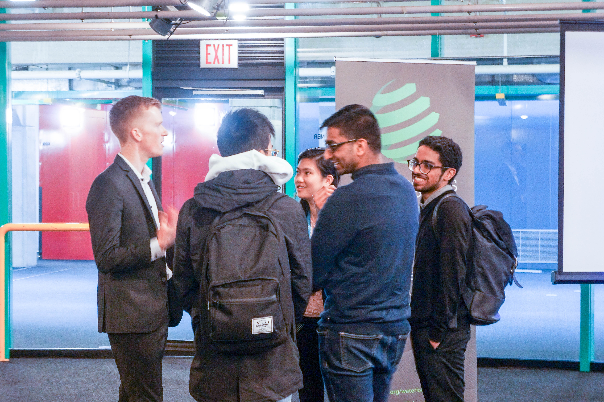

<!-- Chang is a Master’s student in Systems Design Engineering at the University of Waterloo, co-supervised by Prof. Sirisha Rambhatla and Prof. Alex Wong. Chang’s research focus is on unsupervised domain adaptation in Computer Vision, with application to manufacturing and medical imaging. -->

<!-- ### Hi, this is me! -->

<!--  -->

Hi! This is Chang. I'm a thesis-based [Master’s student](https://vip.uwaterloo.ca/chang-liu/) at the University of Waterloo. I'm co-supervised by [Prof. Sirisha Rambhatla](https://sirisharambhatla.com/) and [Prof. Alex Wong](https://www.linkedin.com/in/alexander-wong-90650216/?originalSubdomain=ca) as part of the [Vision and Image Processing (VIP) Lab](https://vip.uwaterloo.ca/chang-liu/) and [Critical ML Lab](https://sirisharambhatla.com/criticalml/). My research focus is on unsupervised domain adaptation for semantic segmentation, with application to manufacturing, self-driving and medical imaging.

[Email](chang.liu@uwaterloo.ca) | [Twitter/X](https://x.com/hellochangg) | [LinkedIn](www.linkedin.com/in/hellochang/)

<!-- Check out some of my latest [projects](https://hellochang.com/projects/). -->

<!-- Email: chang [dot] liu [at] uwaterloo [dot] ca -->

### Publications
1. [**Chang Liu, Saad Hossain, C Thomas, Henry Lai, Ravi Vemulapalli, Sirisha Rambhatla, and Alexander Wong.** *LangDA: Adapting visual features with instruction tuning for semantic segmentation.*](https://openreview.net/pdf?id=iyULilaeYx) Adaptive Foundation Models @ NeurIPS 2024.

2. **Chang Liu, Karim Habashy, Yuchen Pan, Sirisha Rambhatla, and Alexander Wong.** *Scaled Skip Connections for Semantic Detail Control in Diffusion Models.* Conference on Vision and Intelligent Systems (CVIS), December 2024.

3. **Chang Liu, Saad Hossain, C Thomas, Henry Lai, Ravi Vemulapalli, Sirisha Rambhatla, and Alexander Wong.** *LangDA: Language-guided Domain Adaptive Semantic Segmentation.* Conference on Vision and Intelligent Systems (CVIS), Best Vision Paper, December 2024.

### Professional Services
Chair & Organizer, 10th Annual Conference on Vision and Intelligent Systems (CVIS 2024)

Mentor, [Grace Hopper Celebration](https://ghc.anitab.org/) (GHC 2023)

### Talks & Poster Presentations
LangDA: Language-guided Domain Adaptive Semantic Segmentation [Poster], NeurIPS Adaptive Foundational Model Workshop, Dec 2024

Scaled Skip Connections for Semantic Detail Control in Vision Transformer Based Diffusion Models [Poster], Conference on Vision and Intelligent Systems, Dec 2024

Language-guided Domain Adaptive Semantic Segmentation [Slides], Conference on Vision and Intelligent Systems, Dec 2024

Context-Aware Unsupervised Semantic Segmentation Under Distribution Shift [Slides][Seminar Link], University of Waterloo, Nov 2024

### Teaching
Teaching Assistant, SYDE 577 - Deep Learning, Sept 2024 – Dec 2024

Teaching Assistant, CS 247 - Software Engineering Principles, May 2020 – Aug 2020

<!-- ### Professional interests
So far, I liked every subject– they all serve a purpose and I enjoy learning about them. I just love learning haha.

In particular though, I really enjoy STEM subjects. Right now, I'm aspiring to be a professional Data Sceintist or perhaps a Software Engineer for my future career, and I've had 5+ internships in the field. -->

<!-- ### Outside of Work

I absolutely love reading! I can’t spend a day without reading at least a couple of pages of a book, no matter how busy I am.

Apart from reading, I especially like photojournalism and travel photography. I really enjoy capturing people's life in different countries and understanding various cutlures.  -->

<!-- and I always marvel at how vast, different yet similar the world can be. -->

 <!-- I’ve been to quite a few places (Ecuador, Tanzania, Greece, Israel, South Korea, to name a few). -->

<!-- to promote mutual understanding from cultures . Capture photos to show similarities and differences -->

<!-- But I recently got into portraiture and event photography, perhaps because quite a few student societies I joined needed me to cover for their event (such as 180 consulting, Women in CS, and MathSoc). -->

<!--  -->

<!-- I also realized that photography is a great way to document our family life moments since I’m spending so much time away from my family in university.  -->

<!--  -->

<!-- When I'm not coding or doing any of the above, you could find me sailing, kayaking, swimming, camping, hiking, skiing, skating, running, doing yoga, playing ultimate frisbee, playing basketball, playing badminton, drawing, playing clarinet, and more. I've dabbled in quite a few sports and I challenge you to find something that I haven't tried! -->

<!--  -->
